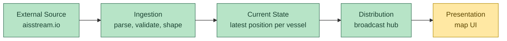
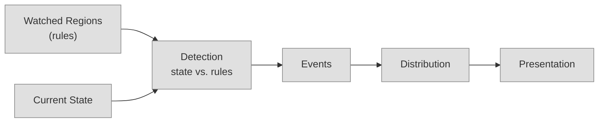

# System Design

**Status:** Draft — Phase 0
**Last updated:** 2026-09-09

## What this is

A digital twin: a live, queryable mirror of real-world vessel state, built
from AIS telemetry. Concretely: a streaming ingest pipeline with a
last-write-wins current-state store and pub/sub distribution to clients.

No event log. Each incoming AIS position report is a complete snapshot of
"where this vessel is as of this timestamp," not a delta that needs
accumulating against prior events to mean anything. That's a direct
consequence of what's out of scope in [requirements.md](./requirements.md)
— historical tracking/playback and advanced analytics are exactly the
things a persisted, replayable event log would be for. Without them,
current state doesn't need to be a rebuildable projection of anything; it
can just *be* the source of truth.

## Pipeline

🟢 done · 🟡 partial · ⚪ not started — see [Where we are now](#where-we-are-now)

Five roles, deliberately without an implementation attached yet:

- **External source** — something out there emitting vessel positions over
  time. (aisstream.io, currently.)
- **Ingestion** — the boundary between "their format" and "our format."
  Also where flaky/noisy data gets filtered before touching anything else.
- **Current state** — the single source of truth for "what does the
  system currently believe," per vessel.
- **Distribution** — however "current state changed" gets communicated
  outward to whoever's consuming it.
- **Presentation** — turns state into something a human can look at.

Later phases (watched regions / entry detection) add a second path that
*reads* Current State rather than replacing anything above:

## Decisions

Built and proven, not just proposed, unless noted otherwise:

- **Current state store:** in-memory, keyed by MMSI, one writer (ingest)
  and many readers (every connected client). A `sync.RWMutex`-guarded map
  — no channel-owned actor pattern needed at this scale. Trail entries
  use a fresh-allocation-on-append strategy so a `Snapshot()` reader can
  never race a concurrent `Upsert` on the same backing array. Race-tested
  (`go test -race`).
- **Ingestion API:** `ingest.Connect` returns a `*Connection` (a `Pings`
  channel + `Err()`), not a callback — the wiring from ingest's output to
  its consumers (`Store.Upsert`, `Hub.Broadcast`) is a visible loop in
  `main.go`, not threaded invisibly through a passed-in function.
- **Distribution:** a broadcast hub (`internal/api`) — a mutex-guarded
  set of connected clients, one goroutine per client (write loop +
  disconnect-detecting read loop), `Broadcast` skips a client whose
  buffer is full rather than blocking on it. Race-tested. Verified live
  against the real feed via a raw WebSocket client (`wscat`), not just
  in isolation.
- **Persistence, when it shows up (Phase 4/5 — regions, recent events):**
  still a strawman — SQLite, not Postgres. Nothing here needs
  multi-writer concurrency or a separate DB process; SQLite is zero-ops
  and fits the single-box, low-cost deployment NFR directly.
- **Serving the frontend:** the same Go binary serves it, no separate
  static host/CDN. Vite's job ends at `vite build` — producing a static
  `dist/` folder — it's not a production server. The backend serves
  those files directly (`http.FileServer`, same `mux` as `/health`,
  `/ws`, `/api`), consistent with the single-box, one-process,
  low-cost NFR — a separate static host (Netlify/Vercel/S3+CloudFront)
  would add a second deployment target and CORS config for a scale
  benefit this project doesn't need.
- **Presentation:** MapLibre GL, not a custom three.js/WebGPU renderer —
  see roadmap.md Phase 8 for the full reasoning (industry-standard for
  this exact use case, built-in clustering and globe projection, and
  the custom-rendering skill this would have demonstrated is already
  covered elsewhere). A Web Worker owns the WebSocket connection and
  batches updates before handing them to the main thread — that's
  where the concurrency/performance work actually applies, since
  MapLibre's own rendering isn't something to inject custom code into.

## Where we are now

- **External source:** connected — `ingest.go` holds a live WS connection
  to aisstream.io.
- **Ingestion:** done — typed, validated, shaped into `vessel.Ping` +
  identity. Known gap: no reconnect on failure yet (Phase 7).
- **Current state:** done — `internal/store`, race-tested.
- **Distribution:** done — `internal/api` (WebSocket hub), race-tested
  and verified live.
- **Presentation:** design settled (MapLibre GL + Worker-based data
  pipeline), no code yet — this is the active phase (Phase 8).
