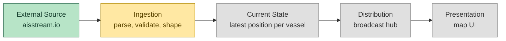
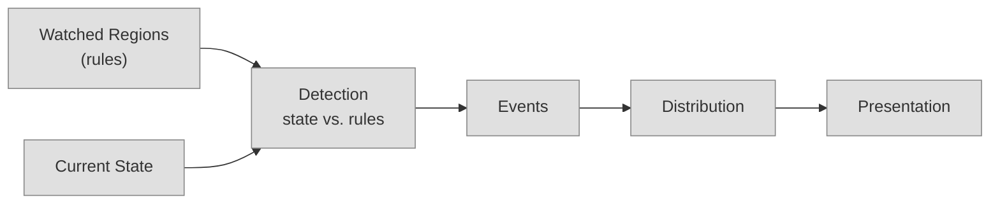

# System Design

**Status:** Draft — Phase 0
**Last updated:** 2026-08-30

## What this is

A digital twin: a live, queryable mirror of real-world vessel state, built
from AIS telemetry. Concretely: a streaming ingest pipeline with a
last-write-wins current-state store and pub/sub distribution to clients.

No event log. Each incoming AIS position report is a complete snapshot of
"where this vessel is as of this timestamp," not a delta that needs
accumulating against prior events to mean anything. That's a direct
consequence of what's out of scope in [requirements.md](./requirements.md)
— historical tracking/playback and advanced analytics are exactly the
things a persisted, replayable event log would be for. Without them,
current state doesn't need to be a rebuildable projection of anything; it
can just *be* the source of truth.

## Pipeline

🟢 done · 🟡 partial · ⚪ not started — see [Where we are now](#where-we-are-now)

Five roles, deliberately without an implementation attached yet:

- **External source** — something out there emitting vessel positions over
  time. (aisstream.io, currently.)
- **Ingestion** — the boundary between "their format" and "our format."
  Also where flaky/noisy data gets filtered before touching anything else.
- **Current state** — the single source of truth for "what does the
  system currently believe," per vessel.
- **Distribution** — however "current state changed" gets communicated
  outward to whoever's consuming it.
- **Presentation** — turns state into something a human can look at.

Later phases (watched regions / entry detection) add a second path that
*reads* Current State rather than replacing anything above:

## Strawman decisions

These are first-pass, concrete calls — easy to argue with, not load-bearing
until someone does:

- **Current state store:** in-memory, keyed by MMSI, one writer (ingest)
  and many readers (every connected client). A `sync.RWMutex`-guarded map
  is enough at this scale — no need for a channel-owned actor pattern.
- **Persistence, when it shows up (Phase 4/5 — regions, recent events):**
  SQLite, not Postgres. Nothing here needs multi-writer concurrency or a
  separate DB process; SQLite is zero-ops and fits the single-box,
  low-cost deployment NFR directly.
- **Distribution:** a broadcast hub — ingest writes an update, a hub
  goroutine fans it out to every connected WebSocket client. Standard
  pub/sub fan-out, no persistence in the pipe itself.

## Where we are now

- **External source:** connected — `ingest.go` holds a live WS connection
  to aisstream.io.
- **Ingestion:** partial — raw messages are received and logged, but not
  yet parsed into a typed `Vessel` struct or validated. This is the
  current gap (Phase 2).
- **Current state:** not built yet.
- **Distribution:** not built yet.
- **Presentation:** not built yet (frontend is still the unmodified Vite
  template).
